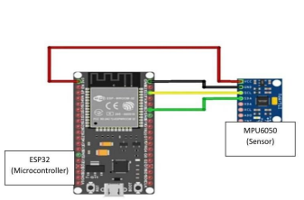
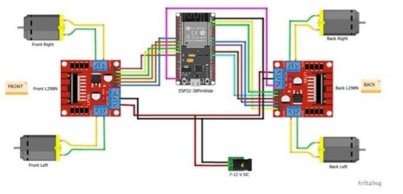

# AuraBot – Hand Gesture Controlled Robot

##  Overview
AuraBot is a wireless hand gesture-controlled robot that moves according to the orientation of the user’s hand. The system uses an MPU6050 accelerometer/gyroscope sensor mounted on a glove to detect motion and transmits the data wirelessly to a NodeMCU on the robot body.

The project combines embedded systems, wireless communication, sensors, and robotics to demonstrate intuitive human–machine interaction.

---

##  Objectives
- Design and implement a wireless hand gesture-controlled robot
- Understand the working principles of MPU6050 and NodeMCU communication
- Develop a simple and efficient gesture detection algorithm
- Enhance practical skills in embedded systems, electronics, and control
- Test and analyze robot response to different gestures

---

##  Components Used
- NodeMCU (ESP8266)
- MPU6050 Accelerometer/Gyroscope
- H-Bridge Motor Driver
- DC Motors
- Battery
- Breadboard
- Wires and connectors

---

##  Working Principle
The MPU6050 detects hand orientation in the X, Y, and Z axes. Based on the tilt direction of the hand, gesture commands are sent wirelessly to the robot controller.

### Supported Gestures
- Forward Tilt → Move Forward
- Backward Tilt → Move Backward
- Left Tilt → Turn Left
- Right Tilt → Turn Right
- Hand Flat → Stop

---

##  System Architecture

### Transmitter Unit
The glove-side unit contains:
- MPU6050 sensor
- NodeMCU
- Gesture reading and transmission logic

### Receiver Unit
The robot-side unit contains:
- NodeMCU
- Motor driver
- DC motors
- Motion execution logic

---

##  Circuit Diagrams

### Transmitter Circuit

>Figure: Transmitter unit illustrating MPU6050-based hand gesture sensing and wireless data transmission using NodeMCU.

### Receiver Circuit

>Figure: Receiver unit showing NodeMCU-based motor control and motion execution using an H-bridge and DC motors.
---

##  Software
The project was implemented using **Arduino IDE**.

### Code Files
- `code/transmitter/Transmitter_code.ino`
- `code/receiver/Reciever_code.ino`

The code handles:
- Sensor initialization
- Gesture detection
- Wireless communication
- Motion control logic

---

## Project Structure

```bash
├── code/
│   ├── transmitter/
│   │   └── Transmitter_code.ino
│   └── receiver/
│       └── Reciever_code.ino
│
├── docs/
│   ├── AuraBot_Final_Report.pdf
│   ├── transmitter_circuit.png
│   └── receiver_circuit.png
│
└── README.md
```
 ## Testing & Results

The robot was tested using different hand gestures and showed strong response accuracy:
Forward tilt → 98%
Backward tilt → 96%
Left tilt → 95%
Right tilt → 94%
Flat hand → 100%

## Future Improvements
Add obstacle avoidance sensors
Improve wireless communication range
Enhance mechanical design
Apply machine learning for gesture classification

## Author
Sondos Ahmed
